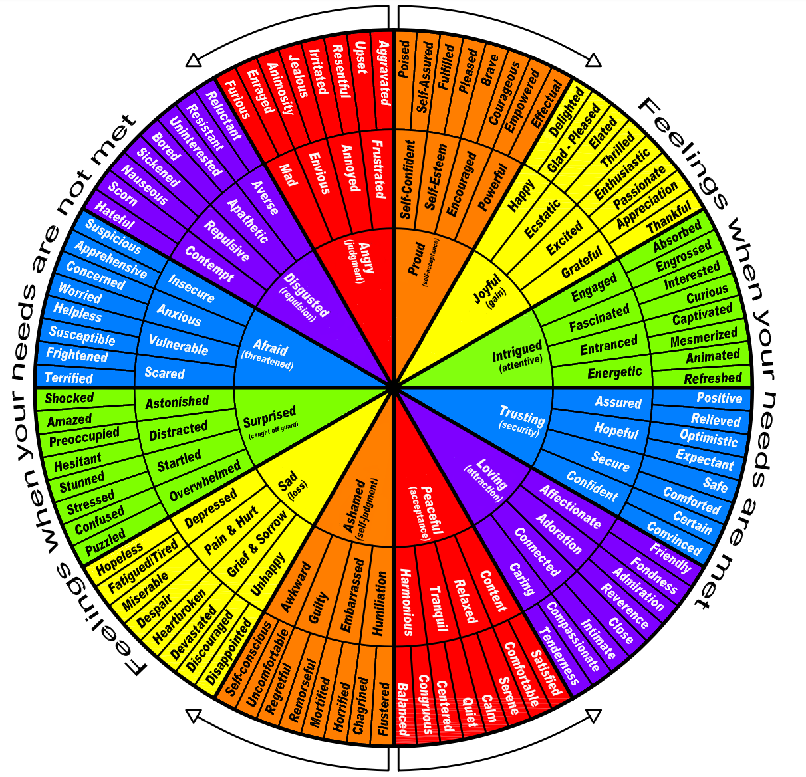

There are a lot of ways to organize and think about feelings, which are internal emotions without words or thoughts. 

I use a feelings wheel based on NVC (Non-violent Communication).

[Same as above but a PDF with citation](archive/non-violent-communications-feelings-wheel.pdf)

## Prompting Events for Emotions

Use this list to reason backwards to what emotion was probably felt.

### Needs Met 

**Proud (self-acceptance)**

- `Effectual` An activity you value was performed well.
- `Encouraged` Someone you trust/value gave you a positive appraisal.

**Joyful (gain)**

- You've gained something.
- A need has been met.

**Intrigued (attentive)**

- Paying close attention leads towards positive emotions.

**Trusting (security)**

- Associating with someone/something could lead toward getting a need met.

**Loving (attractive)**

- Loving a person, animal, or object enhances quality of life for you or for those you care about.
- Loving a person, animal, or object increases your chances of attaining your own personal goals.
  - `Affectionate` The urge to take care of someone/something to get more love.
  - `Reverance` The urge to worship someone/something as they are viewed as godly/divine/perfect.

**Peaceful (acceptance)**

- Events occurring should keep occurring as they are.

### Needs Not Met

**Anger (judgement)** 

- An important goal is blocked or a desired activity is interrupted or prevented.
- You/Your-group/Someone-you-care-about is offended/insulted/attacked/hurt/threatened.
  - `Envy` - Someone-else/group gets/has things you want/need/crave.
  - `Jealousy` - A very important and desired relationship or object in your life is in danger of being damaged or lost.

**Disgust (repulsion)** 

- Someone/Something/A-group you are in contact with could poison/contaminate/harm you/your-group.

**Afraid (threatened)**

- There is a threat to your life/health/well-being of you or someone you care about.

**Surprise (caught off guard)**

- Paying close attention could prevent negative emotions.

**Sadness (loss)** 

- You have lost something or someone permanently.
- Things are not the way you wanted or expected and hoped them to be.

**Ashamed (self-judgement)**

- `Shame` Urge towards silence. You risk being abandoned by a group if characteristics of yourself or of your behavior are made public.
- `Guilt` Your own behavior violates your own values or moral code.

### References

[DBT Emotion Regulation Handouts](https://mydoctor.kaiserpermanente.org/ncal/Images/Emotion%20Regulation%20DBT%20Skills%20ADA%2004292020_tcm75-1598999.pdf)  

[Test Your Emotional Intelligence](https://greatergood.berkeley.edu/quizzes/ei_quiz) (Berkley Greater Good)

[NVC Needs Inventory](https://www.nonviolentcommunication.com/wp-content/uploads/2019/07/feelings_needs.pdf)

-----

v1.5 8-Jan-2025

This work is dedicated to the Public Domain via [CC0 1.0](https://creativecommons.org/publicdomain/zero/1.0/)